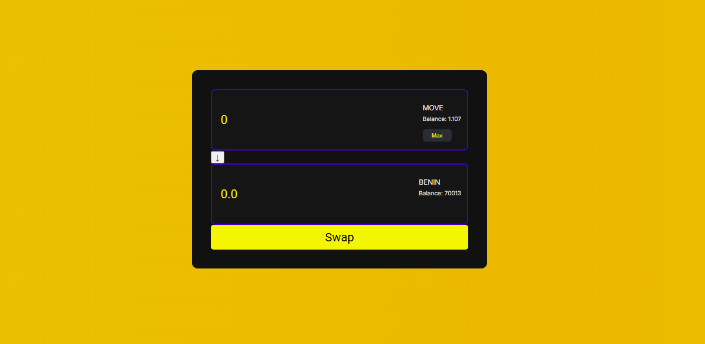

# MoveSwap

**MoveSwap** is a decentralized swap  designed for seamless token exchanges powered by movement. 



## Table of Contents

- [Getting Started](#getting-started)
- [Installation](#installation)
- [Usage](#usage)
- [Technologies Used](#technologies-used)
- [Contributing](#contributing)
- [License](#license)
- [Contact](#contact)


## Getting Started

Follow these instructions to get a copy of the project up and running on your local machine for development and testing purposes.

### Prerequisites

- Node.js (v14.x or higher)
- npm (v6.x or higher)
- A compatible wallet (e.g., MetaMask) installed in your browser for Web3 interactions.

### Installation

1. Clone the repository:
   ```bash
   git clone https://github.com/yourusername/moveswap.git

Navigate to the project directory:

bash
Copy code
cd moveswap
Install the dependencies:

bash
Copy code
npm install
Start the development server:

bash
Copy code
npm run dev
Open your browser and go to http://localhost:3000 to view the application.

Usage
To use MoveSwap:

Connect your wallet (e.g., MetaMask) to the application.
Enter the amount you want to swap or click the Max button to use your entire balance.
Click the Swap button to initiate the transaction.
Confirm the transaction in your wallet.
